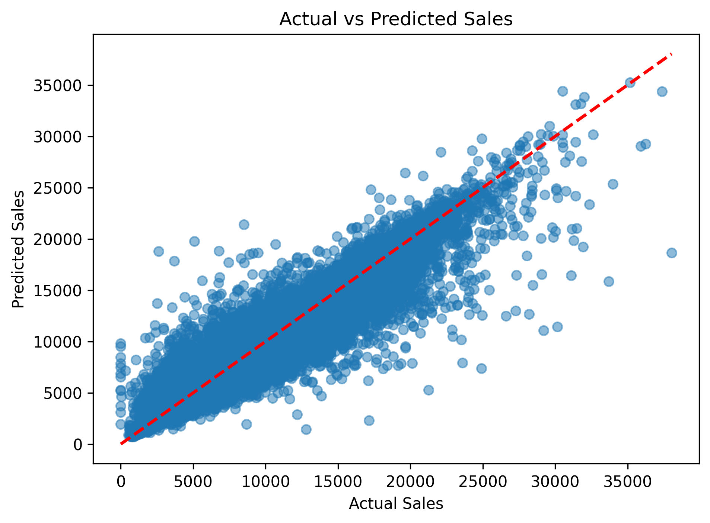

# 🛍️ Retail Sales Forecasting using Machine Learning

## 📌 Project Overview

This project predicts retail store sales using historical sales and store information from the Rossmann Store Sales dataset. Multiple machine learning models were trained and compared to identify the best-performing model for sales prediction.

---

## 🎯 Objective

- Analyze historical retail sales data.
- Perform data cleaning and feature engineering.
- Build and compare multiple regression models.
- Select the best model based on evaluation metrics.
- Generate business insights from the data.

---

## 📂 Dataset

**Dataset:** Rossmann Store Sales

Files used:
- `train.csv`
- `store.csv`

The dataset contains information about:
- Store details
- Promotions
- Holidays
- Competition distance
- Sales
- Customers
- Store type
- Assortment
- Promotion intervals

---

## 🛠️ Technologies Used

- Python
- Pandas
- NumPy
- Matplotlib
- Scikit-learn
- XGBoost
- LightGBM
- Joblib
- Jupyter Notebook

---

## 📊 Machine Learning Workflow

1. Business Understanding
2. Data Cleaning
3. Exploratory Data Analysis (EDA)
4. Missing Value Treatment
5. Feature Engineering
6. One-Hot Encoding
7. Train-Test Split
8. Model Building
9. Model Evaluation
10. Feature Importance Analysis
11. Model Saving

---

## 🤖 Models Trained

- Linear Regression
- Decision Tree Regressor
- Random Forest Regressor
- XGBoost Regressor
- LightGBM Regressor

---

## 📈 Model Performance

| Model | MAE | RMSE | R² Score |
|------|------:|------:|------:|
| Linear Regression | 2011.30 | 2747.02 | 0.2175 |
| Decision Tree | 815.65 | 1315.39 | 0.8206 |
| XGBoost | 858.59 | 1202.86 | 0.8500 |
| LightGBM | 1349.96 | 1813.89 | 0.6588 |
| **Random Forest** ⭐ | **595.13** | **930.69** | **0.9102** |

---

## 🏆 Best Model

**Random Forest Regressor**

Performance:

- MAE: **595.13**
- RMSE: **930.69**
- R² Score: **0.9102**

Random Forest achieved the best overall performance and was selected as the final model.

---

## 📊 Visualizations

### Actual vs Predicted Sales



### Feature Importance


---

## 📁 Project Structure

```
Retail-Sales-Forecasting/
│
├── data/
│   ├── train.csv
│   └── store.csv
│
├── notebooks/
│   └── Retail_Sales_Forecasting.ipynb
│
├── models/
│   └── random_forest_sales_model.pkl
│
├── outputs/
│   ├── actual_vs_predicted.png
│   ├── feature_importance.png
│   ├── feature_importance.csv
│   └── model_comparison.csv
│
├── requirements.txt
├── README.md
└── .gitignore
```

---

## 💾 Saved Model

The trained Random Forest model has been saved using Joblib.

```python
import joblib

model = joblib.load("models/random_forest_sales_model.pkl")
```

---

## 📌 Business Insights

- Promotional campaigns significantly influence sales.
- Seasonal patterns affect store performance.
- Competition-related features impact sales.
- Tree-based ensemble models outperform linear models for this dataset.

---

## 🚀 Future Improvements

- Hyperparameter tuning using GridSearchCV or RandomizedSearchCV.
- Deploy the model using Streamlit.
- Automate the preprocessing pipeline.
- Integrate real-time sales prediction.

---

## 👩‍💻 Author

**Amikula Pavani**

B.Tech + M.Tech (Integrated Dual Degree)  
Computer Science and Engineering  
JNTUH

---

## ⭐ If you found this project useful, consider giving it a star!
